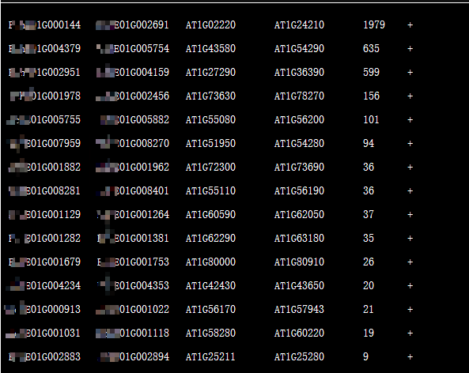
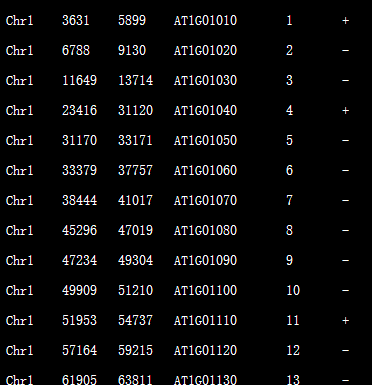
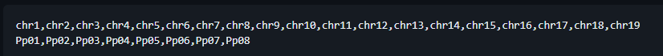
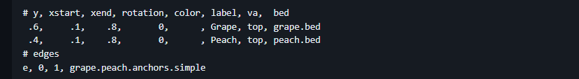
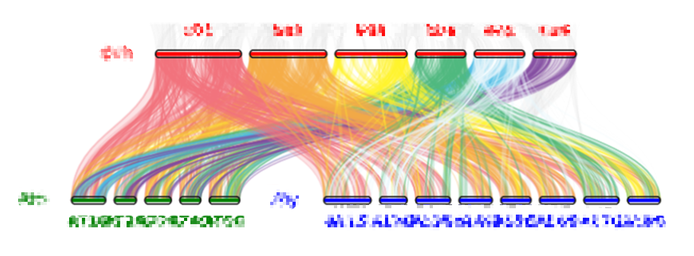

# 利用jcvi绘制共显性图

## 安装jcvi

如果想看看其他安装方法可以去github上看看[jcvi安装](https://github.com/tanghaibao/jcvi)。

```bash
# 本人习惯使用conda安装
conda install bioconda::jcvi
```

## 准备文件

1. 比对后的两组基因组基因文件（官方习惯使用.simple命名）格式如下：

 

2. 准备两个基因组之间的的bed文件：


3. 准备seqids文件：
根据jcvi[官方教程](https://github.com/tanghaibao/jcvi/wiki/MCscan-(Python-version))准备你的seqid文件，这里面的的顺序需要与你后面layout的顺序一致。


4. 准备layout文件：

  layout文件是用来指定基因组之间的联系，格式如下：

在这其中， y表示纵向染色体的位置，然后xstart，xend表示横向染色体的起止位置，最后的color表示染色体的颜色。然后label表示物种名称或者简称，bed表示你所使用的bed文件。下面的edges表示那些基因组和那些基因组有连接，比e,0,1表示第一个和第二个链接，然后e，0,2表示第一个和第三个链接，这里的0,1,2表示上面y开始后面的的基因组的顺序，后面的.simple表示前准备的.simple 文件。所有准备的文件都需要在当前运行的文件夹下，并且layout中所用的文件都是文件的全称，当然你也可以试试绝对路径。

## 运行jcvi

```bash
python -m jcvi.graphics.karyotype seqids layout --notex
```

## 结果

这里是我自己绘制的，你可以根据你自己的调整



颜色可以在.smple文件的第一列添加十六进制的颜色代码和单字母颜色代码，比如#FF0000表示红色，R表示红色。

# 利用awk匹配染色体名字

```bash
awk '/>C/ {print}' your_fasta_file.fa | awk -F '>' '{if (NF>1) print $2}'
```

# sed 结合awk

```bash
awk '{$1 ="rep_" $1;print}' Ech_vs_Min.jcvi.simple |sed 's/rep_EchE06G/#824b9f*EchE06G/g;s/rep_EchE05G/#009fda*EchE05G/g;s/rep_EchE04G/#4db77d*EchE04G/g;s/rep_EchE03G/#fff229*EchE03G/g;s/rep_EchE02G/#f3ab45*EchE02G/g;s/rep_EchE01G/#f0717b*EchE01G/g' |sed 's/rep_//g' >Ech_vs_Min.jcvi_c.simple
awk '{$1 ="rep_" $1;print}' Ech_vs_Aly.jcvi.simple |sed 's/rep_EchE06G/#824b9f*EchE06G/g;s/rep_EchE05G/#009fda*EchE05G/g;s/rep_EchE04G/#4db77d*EchE04G/g;s/rep_EchE03G/#fff229*EchE03G/g;s/rep_EchE02G/#f3ab45*EchE02G/g;s/rep_EchE01G/#f0717b*EchE01G/g' |sed 's/rep_//g' >Ech_vs_Aly.jcvi_c.simple
awk '{$1 ="rep_" $1;print}' Ech_vs_Ath.jcvi.simple |sed 's/rep_EchE06G/#824b9f*EchE06G/g;s/rep_EchE05G/#009fda*EchE05G/g;s/rep_EchE04G/#4db77d*EchE04G/g;s/rep_EchE03G/#fff229*EchE03G/g;s/rep_EchE02G/#f3ab45*EchE02G/g;s/rep_EchE01G/#f0717b*EchE01G/g' |sed 's/rep_//g' >Ech_vs_Ath.jcvi_c.simple
```
