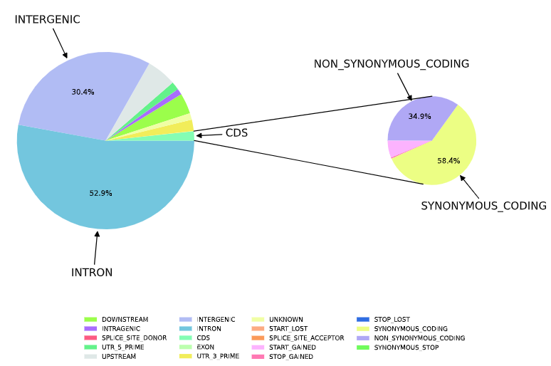

# 20240712记录日常

## 统计snpeff注释结果的数量
```shell
# 利用gawk统计snpeff注释结果的数量，注释数据在倒数第四行
gawk '{print $(NF-3)}' samples.pop.snp.anno.result.list |gawk '{count[$1]++} END {for (value in count) {print value ":", count[value]}}' >samples.pop.snp.anno.result.list.effcet.txt
```


## 绘制车轮图
```python
import os
import numpy as np
import pandas as pd
import matplotlib.pyplot as plt
from matplotlib.patches import ConnectionPatch

# 清除所有环境变量
os.environ.clear()

# 数据路径
data_path = 'data_path/samples.pop.snp.anno.result.list.effcet.txt'

# 读取数据
data_read = pd.read_table(data_path, sep=':', header=None)

# 指定的CDS效果类型
list_cds = ['SYNONYMOUS_STOP', 'STOP_LOST', 'SYNONYMOUS_CODING', 'NON_SYNONYMOUS_CODING', 'START_GAINED', 'STOP_GAINED']
col_name = ['effect', 'number']
data_read.columns = col_name
data_read['order'] = 1

# 标记CDS效果类型的order
data_read['order'].loc[data_read['effect'].isin(list_cds)] = 2

# 计算CDS的总数
cds_sum = data_read.loc[data_read['order'] == 2, 'number'].sum()
cds_raw = pd.DataFrame({'effect': 'CDS', 'number': cds_sum, 'order': 1}, index=[0])

# 数据合并和排序
data_read = pd.concat([data_read, cds_raw], ignore_index=True)
data_read_sort = data_read.sort_values('order').reset_index(drop=True)

# 预设颜色
color_preset = {'DOWNSTREAM': '#9bfe4b', 'INTRAGENIC': '#a96dfd', 'SPLICE_SITE_DONOR': '#fc5b83', 'UTR_5_PRIME': '#63f28a',
                'UPSTREAM': '#dfe8e7', 'INTERGENIC': '#b1bcf4', 'INTRON': '#73c6de', 'CDS': '#84fdb4', 'EXON': '#bcffaf',
                'UTR_3_PRIME': '#f1ed5a', 'UNKNOWN': '#f0fea4', 'START_LOST': '#fcab83', 'SPLICE_SITE_ACCEPTOR': '#fb9a5a',
                'START_GAINED': '#fcb3fe', 'STOP_GAINED': '#ff79b3', 'STOP_LOST': '#2f6de2', 'SYNONYMOUS_CODING': '#ecfe84',
                'NON_SYNONYMOUS_CODING': '#b0a8f5', 'SYNONYMOUS_STOP': '#70fb5d'}
data_read_sort['colors'] = data_read_sort['effect'].map(color_preset)

pi1_data = data_read_sort[data_read_sort['order'] == 1]
pi2_data = data_read_sort[data_read_sort['order'] == 2]

# 设置显示的值函数
def make_autopct(values):
    def my_autopct(pct):
        total = sum(values)
        val = int(round(pct * total / 100.0))
        return f'{pct:.1f}%' if pct >= 25 else ''
    return my_autopct

# 创建图形和子图
fig = plt.figure(figsize=(9, 7))
ax1 = fig.add_subplot(121)
ax2 = fig.add_subplot(122)

# 大饼图
wedges1, texts1, autotextlists1 = ax1.pie(pi1_data['number'], autopct=make_autopct(pi1_data['number']),
                                          startangle=18, colors=pi1_data['colors'], textprops={'fontsize': 8})
ax1.legend().set_visible(False)

# 获取每个扇形的中心角度
angles = [(w.theta2 + w.theta1) / 2 for w in wedges1]
labels = list(pi1_data['effect'])
labels_to_show = ['INTERGENIC', 'INTRON', 'CDS']

# 为选定的标签添加注释和箭头
for i, (label, angle) in enumerate(zip(labels, angles)):
    if label in labels_to_show:
        x = np.cos(np.radians(angle))
        y = np.sin(np.radians(angle))
        text_x = x * 1.5
        text_y = y * 1.5
        ax1.annotate(f"{label} ", xy=(x, y), xytext=(text_x, text_y),
                     textcoords='data', arrowprops=dict(arrowstyle="-|>", color='black'),
                     ha='center', va='center', fontsize=12)

# 小饼图
wedges2, texts2, autotextlists2 = ax2.pie(pi2_data['number'], autopct=make_autopct(pi2_data['number']),
                                          startangle=-180, colors=pi2_data['colors'], textprops={'fontsize': 8}, radius=0.5)
ax2.legend().set_visible(False)

# 获取每个扇形的中心角度
angles2 = [(w.theta2 + w.theta1) / 2 for w in wedges2]
labels2 = list(pi2_data['effect'])
labels_to_show2 = ['SYNONYMOUS_CODING', 'NON_SYNONYMOUS_CODING']

# 为选定的标签添加注释和箭头
for i, (label, angle) in enumerate(zip(labels2, angles2)):
    if label in labels_to_show2:
        x = np.cos(np.radians(angle)) * 0.48
        y = np.sin(np.radians(angle)) * 0.48
        text_x = x * 2
        text_y = y * 2
        ax2.annotate(f"{label} ", xy=(x, y), xytext=(text_x, text_y),
                     textcoords='data', arrowprops=dict(arrowstyle="-|>", color='black'),
                     ha='center', va='center', fontsize=12)

# 定义链接的位置
label_connect = 'CDS'
pi1_patch_dic = list(pi1_data['effect']).index(label_connect)
pos_label = pi1_patch_dic

# 连接线1：大饼图顶部和小饼图顶部
theta1, theta2 = ax1.patches[pos_label].theta1, ax1.patches[pos_label].theta2
center, r = ax1.patches[pos_label].center, ax1.patches[pos_label].r
x = r * np.cos(np.pi / 180 * theta2) + center[0]
y = np.sin(np.pi / 180 * theta2) + center[1]
con1 = ConnectionPatch(xyA=(0, 0.5), xyB=(x, y), coordsA=ax2.transData, coordsB=ax1.transData, axesA=ax2, axesB=ax1)

# 连接线2：大饼图底部和小饼图底部
x = r * np.cos(np.pi / 180 * theta1) + center[0]
y = np.sin(np.pi / 180 * theta1) + center[1]
con2 = ConnectionPatch(xyA=(-0.1, -0.49), xyB=(x, y), coordsA='data', coordsB='data', axesA=ax2, axesB=ax1)

# 连接线添加到图中
for con in [con1, con2]:
    con.set_color('black')
    ax2.add_artist(con)
    con.set_linewidth(1)

# 显示图例
fig.legend(wedges1 + wedges2, list(pi1_data['effect']) + list(pi2_data['effect']), loc='lower center', ncol=4, frameon=False, fontsize=7)

plt.tight_layout()
plt.savefig('save_path/samples.pop.snp.anno.result.list.effcet.pdf')
plt.show()
```
### 绘制效果图
